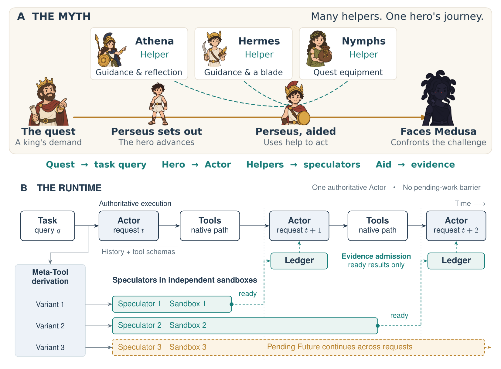
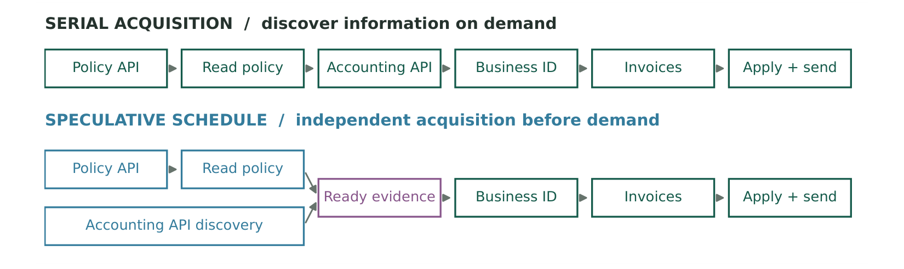

<div align="center">

# PERSEUS

### Non-Blocking Parallel Exploration with a Speculative Swarm

**One Actor. Broader discovery. Evidence ahead of demand.**

[Paper](docs/paper/perseus-iclr2027-submission.pdf) · [中文](README.zh-CN.md) · [Architecture](docs/architecture.md) · [Validation](docs/validation.md) · [Downloads](https://github.com/HuiCir/Perseus/releases)

**Prototype 0.9.0** &nbsp; | &nbsp; **Codex 0.2.1** &nbsp; | &nbsp; **DSH 0.1.3** &nbsp; | &nbsp; **MIT code**



</div>

PERSEUS separates **exploration breadth** from **task authority**. An Actor continues its native task loop, while single-round Speculators inspect complementary information in independent work copies. Completed observations reach later Actor decisions as evidence; unfinished acquisitions continue in persistent Futures. The swarm does not own the task, commit copy writes, or wait at a collective join barrier.

This repository contains the **algorithm prototype** and **native Codex / DeepSeek Harness plugins**. The prototype is a research demo; the adapters implement the protocol within the interfaces each harness exposes. Their compatibility boundaries are documented rather than presented as identical implementations.

> The accompanying manuscript is an **anonymous submission under review at ICLR 2027**. It is not an accepted publication. Paper results below describe its experimental setup, not a performance guarantee for the plugins.

## How it works

| Mechanism | What it contributes |
| --- | --- |
| **Meta-Tool domains** | Native schemas and successful authoritative invocation heads define disjoint acquisition scopes. A complement preserves uncovered legal calls. |
| **Single-round exploration** | Each eligible domain proposes acquisitions from the current authoritative observations. Complete streamed arguments can execute immediately after validation. |
| **Independent execution** | Every acquisition has its own work copy and provenance. Temporary changes are never merged into Actor state. |
| **Persistent Futures** | Repeated in-flight acquisitions share execution. Pending work survives later Actor requests instead of blocking or being discarded at every boundary. |
| **Ready-only evidence** | Completed, unreviewed observations are admitted with their sources and duplicate handling. The Actor interprets them and owns every authoritative action. |

New authoritative progress can refresh exploration. Evidence admission alone does not launch another wave. Opaque shell strings are not heuristically classified into action domains.



*Figures 1 and 5 reproduced from the accompanying manuscript. The second diagram shows logical dependency stages, not measured elapsed time. [Figure provenance](docs/assets/paper-figure-provenance.json).*

## Choose an implementation

| Component | Version | Intended use | Entry point |
| --- | --- | --- | --- |
| [Algorithm prototype](prototype/) | 0.9.0 | Inspect and experiment with the research runtime and independent execution contract | `prototype/perseus` |
| [Codex plugin](plugins/codex/) | 0.2.1 | Codex Desktop / native CLI plugin, hooks and MCP | Native plugin marketplace |
| [DSH Host plugin](plugins/dsh/) | 0.1.3 | Cordis plugin for **DSH 0.2.0-rc.2** | Prebuilt npm tarball |
| [DSH settings UI](plugins/dsh-ui/) | 0.1.0 | Web/Desktop settings card using the official `dsh.client` interface | Separate optional package |
| [DSH debug panel](plugins/dsh-panel/) | 0.1.0 | Experimental profile-specific debug UI | Optional; not installed by default |

### Codex

The Actor's **model and reasoning effort follow the session**. The Speculator defaults to **`gpt-6-luna / high`** and uses the current native Codex account. Native `model/list` metadata determines a supported effort before creating the worker or its cache identity. The plugin does not rewrite account settings or global model defaults.

Download and unpack `codex-plugin-perseus-0.2.1.tar.gz`, then register the extracted marketplace:

```sh
codex plugin marketplace add /absolute/path/to/extracted-marketplace
codex plugin add perseus@perseus-local
codex
```

Review and trust the nine command hooks through Codex's normal trust flow, then load a new session. A working native Codex binary, Node.js 24+, `rg`, and macOS Seatbelt are required for the tested backend. [Installation and compatibility](plugins/codex/README.md).

### DeepSeek Harness

Install the prebuilt Host package into an existing native-tools profile; add the settings card separately if needed:

```sh
dsh plugin --profile YOUR_PROFILE add /absolute/path/dsh-plugin-perseus-0.1.3.tgz
dsh plugin --profile YOUR_PROFILE add /absolute/path/dsh-plugin-perseus-ui-0.1.0.tgz
dsh --profile YOUR_PROFILE --dump-config
```

The Actor remains the official AgentLoop. Speculator route overrides affect only exploration; omitted route fields inherit the Actor route. The recorded real-model validation used `deepseek-flash` with the existing account. [Host configuration and supported tools](plugins/dsh/README.md).

### Algorithm prototype

```sh
cd prototype
./perseus --help
```

For a real run, configure the Actor / Speculator providers and a tool host with a genuine independent execution contract. The example environment file contains placeholders, not credentials. [Prototype guide](prototype/README.md).

## Results in the manuscript

The main study uses **183 selected tasks**, three attempts each, across AutomationBench, τ²-Bench, Terminal-Bench and GAIA. Its model pair is **GPT-5.6 Terra / GPT-5.6 Luna**, both at high reasoning effort. These are different models and conditions from the current Codex plugin configuration.

| Benchmark | Tasks | ReAct task success | PERSEUS task success |
| --- | ---: | ---: | ---: |
| AutomationBench | 36 | 27.8% | **39.8%** |
| τ²-Bench | 60 | 66.7% | **77.8%** |
| Terminal-Bench | 31 | 69.9% | **81.7%** |
| GAIA | 56 | 56.0% | **67.3%** |
| **Overall, task-count weighted** | **183** | **56.3%** | **67.8%** |

Overall **Execution Speed**, defined as aggregate success divided by aggregate execution time, rises from **2.43 to 3.20 × 10⁻³ s⁻¹**. PERSEUS has the highest overall task success among the 13 evaluated baselines; it does **not** have the highest overall Execution Speed. Table 1, Appendix B and the manuscript provide selection criteria, budgets, variation and aggregation rules.

On the 85-case component study, full PERSEUS reaches 56.9% task success, versus 47.1% without Meta-Tool derivation, 52.9% without the swarm and 49.0% without persistent Futures. This supports the complementary roles of scope, breadth and lifetime; it is not a universal speedup claim. The short-call BFCL study is slower and less accurate than ReAct overall.

## Engineering boundaries

- The **Codex adapter operates at hook/tool boundaries**, which are not internal model-request boundaries. It provides an explicit `command_exec` MCP contract because hooks do not expose a complete built-in tool registry. Positive-domain cache prefixes remain stable; changed complements receive fresh threads. Actor and Speculator model caches are separate.
- The **DSH adapter uses native request, stream, session and tool interfaces**. Its built-in isolated provider covers compatible read/write/edit/grep/glob/bash tools; external MCP, browser, API and database state require separate isolated providers.
- The tested isolation backends are **macOS-specific**. Unsupported execution scopes fail closed. Codex command isolation denies `posix_spawn` and detached process groups; Node tests inside acquisitions need `--test-isolation=none`. DSH's shell contract covers managed process groups, not deliberately detached daemons.
- Evidence can be stale or valid only in a copy. The Actor must verify relevant current state before committing changes. More exploration consumes additional resources and can hurt short or low-information tasks.

See [architecture](docs/architecture.md) and [validation](docs/validation.md) for the exact adapter differences and recorded checks. Runtime logs, sessions, account files, model outputs and development dependencies are excluded from this distribution.

## Build the distribution

```sh
node scripts/package-release.mjs
```

The command assembles the prototype ZIP, Codex marketplace archive, prebuilt DSH packages, complete source ZIP and checksums. It requires the component development dependencies described in their READMEs. It never installs plugins into the user's active harness profiles or starts a model run.

## Citation and licenses

```bibtex
@misc{perseus2026,
  title = {PERSEUS: Non-Blocking Parallel Exploration with a Speculative Swarm},
  author = {{Anonymous authors}},
  year = {2026},
  note = {Under review at ICLR 2027}
}
```

Code is distributed under [MIT](LICENSE), with component notices retained in [THIRD_PARTY_NOTICES.md](THIRD_PARTY_NOTICES.md). The manuscript and reproduced figures are accompanying research materials; the code license does not independently relicense third-party material inside them.
